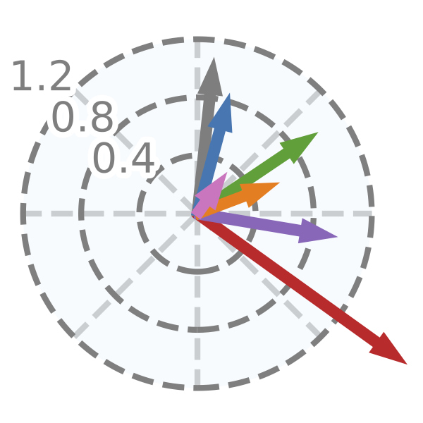

<picture align="center">
  <source media="(prefers-color-scheme: dark)" srcset="examples/pima/pima_only_clock.png">
  
</picture>

# Feature Clock: High-Dimensional Effects in Two-Dimensional Plots

| | 
| --- | 
| [Package](https://pypi.org/project/feature-clock/) 
| [Documentation](tutorials/docs.md) 
| [Tutorial](tutorials/iris.md) 
| [Examples](https://github.com/OlgaOvcharenko/feature_clock_visualization/tree/main/test) 

[](https://github.com/pylint-dev/pylint)

## What is it?

It is difficult for humans to perceive high-dimensional data. Therefore, high-dimensional data is projected into lower dimensions to visualize it. 
Many applications benefit from complex nonlinear dimensionality reduction techniques (e.g., UMAP, t-SNE, PHATE, and autoencoders), but the effects of individual high-dimensional features are hard to explain in the latent spaces. 
Most solutions use multiple two-dimensional plots to analyze the effect of every variable in the embedded space, but this is not scalable, leading to k plots for k different variables. 
Our solution, **Feature Clock**, provides novel visualizations that eliminate the need for multiple plots to inspect the influence of original variables in the latent space. **Feature Clock** enhances the explainability and compactness of visualizations of embedded data.

## Table of Contents

- [Main Features](#main-features)
- [Where to get it](#where-to-get-it)
- [Installation](#instalation)
- [License](#license)
- [Documentation](#documentation)

## Main Features
**Feature Clock** allows creation of three types of static visualizations, highlighting the contributions of the high-dimensional features to linear directions of the two-dimensional spaces produced by nonlinear dimensionality reduction: 

- ***Global* Feature Clock** indicating the direction of features’ contributions in low-dimensional space for the whole dataset.
- ***Local* Feature Clock** explaining features’ impact within selected points.
- ***Inter-group* Feature Clock** visualizing contributions between groups of points. 

## Where to get it
The source code is currently hosted on GitHub at:
https://github.com/OlgaOvcharenko/feature_clock_visualization.git

Binary installers for the latest released version are available at the [Python
Package Index (PyPI)](https://pypi.org/project/feature-clock/).

```sh
# PyPI
pip install feature-clock
```

## Instalation
Feature Clock can be installed from PyPI:

```sh
pip install feature-clock
```

All dependencies are listed in [requirements.txt](requirements.txt) and can be installed separately.

```sh
pip install -r requirements.txt
```

## License
[Apache License Version 2.0](LICENSE)

## Documentation
There is [documentation](tutorials/docs.md), and a simple [tutorial](tutorials/iris.md).


<hr>

[Go to Top](#table-of-contents)
